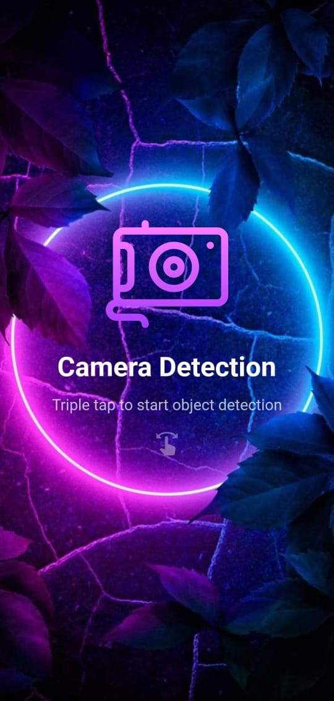
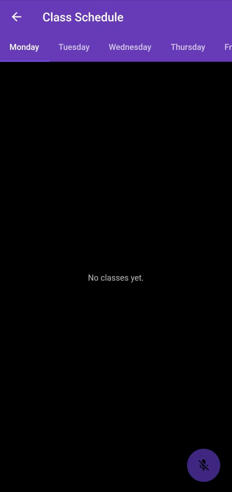

# GCUeye - AI Navigation Assistant for Visually Impaired Students


## 🎯 Overview

GCUeye is an AI-powered mobile navigation assistant designed to help visually impaired students navigate GC University Lahore campus independently. The app uses YOLOv8 object detection to identify obstacles in real-time and provides voice and haptic feedback through a fully accessible, gesture-based interface.

**👨‍💻 Developed by:** Ahtisham & Danish

---

## ✨ Key Features

- 🤖 **Real-time Object Detection** - YOLOv8 identifies stairs, people, and furniture
- 🗺️ **Offline Indoor Navigation** - Graph-based routing without GPS/Bluetooth
- 👆 **Gesture-Based Interface** - Fully accessible, no visual elements needed
- 🔊 **Voice Feedback** - Text-to-speech alerts for obstacles
- 📳 **Haptic Feedback** - Vibration patterns for different obstacles
- ⏰ **Voice-Controlled Reminders** - Class schedule management
- 🆘 **Emergency SOS** - Long-press gesture for emergency alerts
- ⚙️ **Customizable Accessibility** - Adjust speech, pitch, vibration

---

## 🏗️ Project Structure

```
GCUeye/
├── flutter_app/           # Mobile application (Flutter/Dart)
├── flask_server/          # Backend API server (Python/Flask)
├── app_screenshots/       # Application screenshots
├── GCUeye_Documentation.pdf   # Complete project documentation
└── overview.pptx          # Project presentation
```

---

## 🛠️ Tech Stack

### Mobile App (Flutter)
- **Framework:** Flutter (Dart)
- **State Management:** Provider/BLoC
- **Storage:** SQLite
- **APIs:** Camera, TTS, Accelerometer

### Backend (Flask)
- **Framework:** Flask (Python)
- **ML Model:** YOLOv8 (Ultralytics)
- **Computer Vision:** OpenCV
- **API:** RESTful architecture

### AI/ML
- **Object Detection:** YOLOv8
- **Training:** TensorFlow/PyTorch
- **Custom Dataset:** Campus-specific obstacles

---

## 📸 Screenshots

<table>
  <tr>
    <td></td>
    <td></td>
    <td></td>
  </tr>
  <tr>
    <td align="center">Home Screen</td>
    <td align="center">Object Detection</td>
    <td align="center">Navigation</td>
  </tr>
</table>

---

## 🚀 Installation & Setup

### Prerequisites
- Flutter SDK 3.0+
- Python 3.8+
- Android Studio / VS Code
- Git

### 1️⃣ Backend Setup (Flask Server)

```bash
# Navigate to backend folder
cd flask_server

# Create virtual environment
python -m venv venv
source venv/bin/activate  # Windows: venv\Scripts\activate

# Install dependencies
pip install -r requirements.txt

# Run server
python app.py
```

### 2️⃣ Mobile App Setup (Flutter)

```bash
# Navigate to app folder
cd flutter_app

# Install dependencies
flutter pub get

# Update API endpoint in config
# Edit lib/config.dart with your Flask server URL

# Run app
flutter run
```

---

## 🎮 How to Use

1. **Launch App** - Open GCUeye on Android device
2. **Grant Permissions** - Camera and location access


## 📊 Performance Metrics

- ⚡ **Detection Speed:** ~30 FPS
- 🎯 **Model Accuracy:** High precision on campus obstacles
- ⏱️ **Response Time:** <1 second (camera to voice)
- 📶 **Offline Capability:** 100% functional without internet

---

## 📚 Documentation

- 📄 **[Complete Documentation](GCUeye_Documentation.pdf)** - Detailed project report
- 📊 **[Project Presentation](overview.pptx)** - Overview slides

---

## 🤝 Contributors

- **Ahtisham** - [@smokhoodwha](https://github.com/smokhood)
- **Danish** - Co-developer

**Institution:** GC University Lahore  

---


## 🙏 Acknowledgments

- GC University Lahore for project support
- Ultralytics for YOLOv8
- Flutter and OpenCV communities

---

## 📧 Contact

For questions or collaboration:
- **Email:** ahtishamravian206@gmail.com
- **GitHub:** [@smokhoodwha](https://github.com/smokhood)

---

**⭐ If you find this project helpful, please consider giving it a star!**

---

*Empowering independence through accessible technology* 🌟
